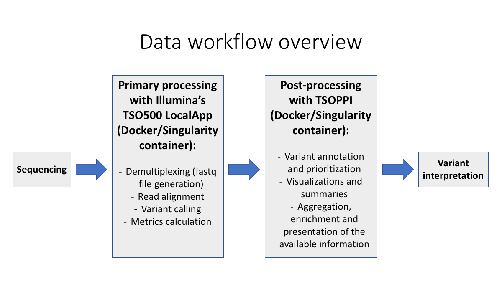
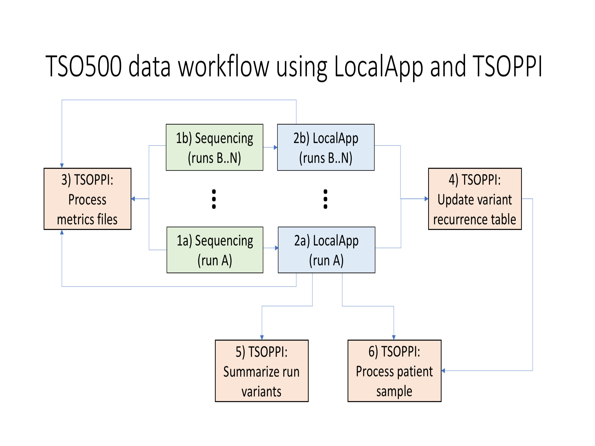

Getting started
===============

Prerequisites
-------------
All of TSOPPI's tools require files generated by Illumina's
:ref:`localapp-label` software on input.
Paths to LocalApp output directories are used as input parameters
for multiple TSOPPI tools, which rely on the standard LocalApp output directory
structure when locating particular files.
(Altering the LocalApp output directory structure is therefore not recommended
if TSOPPI is to be used.)

Similarly to the LocalApp software, TSOPPI is available
as a :ref:`docker-label` and as a :ref:`singularity-label`.
Any system able to run the LocalApp software should therefore be able
to run TSOPPI as well (TSOPPI should generally have lower hardware requirements).

Some of TSOPPI's output is meant to be used with IGV,
but none of the tools requires IGV in order to be run.

Individual TSOPPI tools in the data analysis workflow
-----------------------------------------------------

TSO500 sequencing (1) and primary analysis with LocalApp (2) are necessary
prerequisites for running TSOPPI.

All metric output generated by the LocalApp, as well as some of the core
metrics generated during the sequencing, can be visualized by
:doc:`the metrics plotting tool </metrics_plotting>` (3).
The resulting plots can aggregate metric information across
an arbitrary number of runs, which can be useful for spotting outlier samples
and/or runs, and for monitoring long-term trends in the sequencing
and primary analysis outputs.

:doc:`The variant summarization tool </variant_summary_creation>` (5)
can be used to aggregate variant information across all
"[LocalApp_run_output]/Results/.../\*_CombinedVariantOutput.tsv" files generated
for a given sequencing run. This includes TBM, MSI, CNV, fusion and
splice variant information, but only for variants that are deemed reportable
by the LocalApp software (notably, the somatic/non-somatic status of the various
genomic events might need to be re-evaluated after the post-processing).

The core TSOPPI functionality, post-processing of individual samples/matched
tumor-normal sample pairs, is made available via the
:doc:`RNA sample post-processing </RNA_sample_postprocessing>` (6)
and :doc:`DNA sample post-processing </DNA_sample_postprocessing>` (7) tools.
These tools produce sample-wise QC plots, annotate and prioritize called small variants
with help of `PCGR <https://github.com/sigven/pcgr>`_/`CPSR <https://github.com/sigven/cpsr>`_
and expand LocalApp's copy number output.

The :doc:`variant recurrence table update </variant_recurrence_table_creation>` (4)
tool can be used to summarize small variant recurrence information across
an arbitrary number of LocalApp run outputs. This information can be utilized
during the DNA sample post-processing step, which greatly enhances the ability
to identify recurrent artifact and germline variation in analyzed samples.

.. _localapp-label:

TSO500 LocalApp
---------------
TSOPPI is currently being developed for LocalApp version 2.2.0.12.
While older versions of the LocalApp software might be (and likely are)
fully compatible with TSOPPI, systematic testing is not being done in order to
ensure that\*.

To learn more about the LocalApp software,
please visit `Illumina's dedicated document site <https://emea.support.illumina.com/sequencing/sequencing_kits/trusight-oncology-500/documentation.html>`_.

(\*Please note that prior to version 2.2.0, LocalApp used gene symbol "MYCL1"
instead of "MYCL" during CNV analysis. This can be taken into account during
DNA sample post-processing by setting the '--localapp_version' parameter
to value "2.0.1.4".)

.. _docker-label:

Docker image
------------
TSOPPI is primarily developed as a Docker image, under 'Docker Engine - Community' version 19.03.8.
There are no functionality limitations when using the Docker TSOPPI image.

A TSOPPI Docker image can be loaded from the supplied tar archive
and subsequently referred to by its "[REPOSITORY]/[TAG]" combination when
its individual tools are being run:

.. code-block::

  $ sudo docker load tsoppi_main_v0.1_2021_06_02.tar
  $ sudo docker image ls
  REPOSITORY             TAG      ...
  inpred/tsoppi_main     v0.1     ...

  $ [sudo] docker run \
      --rm \
      -it \
      -v /hs_prefix_path:/inpred/data \
      inpred/tsoppi_main:v0.1 \
        python <tool_script.py> \
          argument_1 \
          ... \
          argument_n \
          --host_system_mounting_directory /hs_prefix_path

For the container software to gain access to sample files located on the host system,
an appropriate host system directory has to be mounted with the "-v" option
(*all input and output files need to be located somewhere inside the
mounted host system directory*).
In the example above, the host system directory "/hs_prefix_path" is mounted
as "/inpred/data" within the container. While the container mounting point should not
be changed, an appropriate host system mounting point needs to be selected by the user
and specified via the '--host_system_mounting_directory' parameter.

.. _singularity-label:

Singularity image
-----------------
Singularity images are generated (with Singularity version 3.4.2-1.el7)
by conversion from a corresponding Docker image.

When running singularity as an unprivileged user,
trying to create IGV screen-shots with the DNA post-processing tool will likely fail
(this feature is by default disabled in all TSOPPI images).

The following command structure can be used for directly running
TSOPPI Singularity images:

.. code-block::

  singularity exec \
    --no-home \
    -B /hs_prefix_path:/inpred/data \
    -W <working_directory> \
    <SINGULARITY_IMAGE_PATH> \
      python <tool_script.py> \
        argument_1 \
        ... \
        argument_n \
        --host_system_mounting_directory /hs_prefix_path

For the container software to gain access to sample files located on the host system,
an appropriate host system directory has to be mounted with the "-B" option
(*all input and output files need to be located somewhere inside the
mounted host system directory*).
In the example above, the host system directory "/hs_prefix_path" is mounted
as "/inpred/data" within the container. While the container mounting point should not
be changed, an appropriate host system mounting point needs to be selected by the user
and specified via the '--host_system_mounting_directory' parameter.

Contact
-------
daniel.vodak [AT] medisin.uio.no
